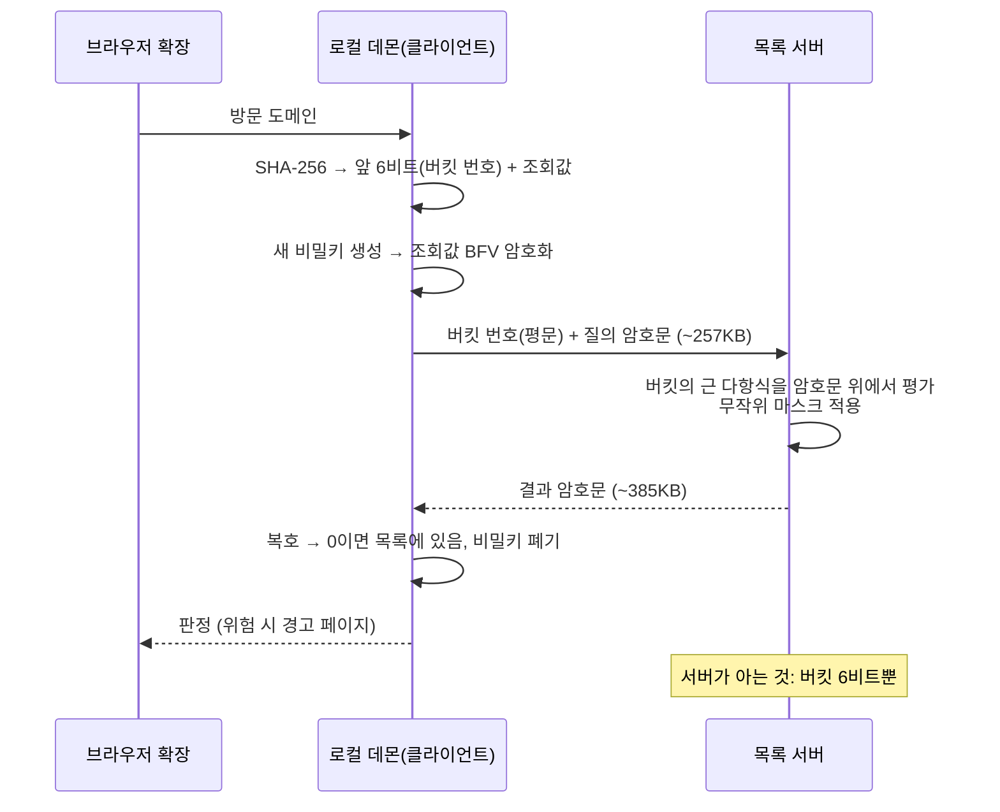

# HE-filter

**서버가 읽을 수 없는 피싱 도메인 조회** — private phishing-domain lookup over homomorphic encryption

브라우저가 "이 도메인이 위험한가"를 확인하는 가장 흔한 방법은 방문하려는 주소를 검사 서버로 보내는 것이다. 검사는 되지만, 그 순간 방문 이력이 서버에 남는다.

이 프로젝트는 그 질문을 **서버가 읽을 수 없는 형태로** 던진다. 도메인을 해시한 값을 BFV 동형암호로 암호화해 보내면, 서버는 자신이 무엇을 검사하는지도, 판정이 무엇인지도 모른 채 암호문 위에서 목록 대조를 수행한다. 복호와 판정은 사용자 쪽에서만 일어난다.

- **서버에 노출되는 정보: 해시 앞 6비트뿐** (Chrome Safe Browsing의 32비트 대비)
- **로컬 왕복 중앙값 16.1ms** (키 생성부터 판정까지, 단일 스레드 구성)
- **실데이터 546,825개 도메인** (공개 피싱 피드 4종 집계, 자동 갱신)

전체가 Windows + Edge에서 브라우저 확장으로 동작하며, 피싱 목록에 있는 도메인에 접속하면 경고 페이지가 뜬다.

<!-- TODO: Edge 경고 페이지 스크린샷 삽입 -->

## 기존 검사와의 비교

피싱 도메인 검사는 이미 여러 층에서 이루어지고 있다. PC 안에서는 백신이, 네트워크 경로에서는 CDN·DNS 사업자가 각자의 방식으로 위험한 접속을 막는다. 문제는 검사 자체가 아니라, **검사를 받기 위해 무엇을 내주는가**다.

| | AhnLab (OS 백신) | Cloudflare (CDN/DNS) | 본 시스템 |
|---|---|---|---|
| 검사 위치 | 사용자 PC 안 (OS 에이전트) | 네트워크 경로 위 (서버 측) | 브라우저 확장 + 원격 목록 서버 |
| 검사자가 보는 것 | URL과 실행 프로세스 전부 (단, 로컬에 머묾) | 접속 도메인 전체 — **차단 이전에 노출이 먼저 일어남** | **질의한 도메인도, 판정 결과도 보지 못함** |
| 개인정보 비용 | 로컬 수집 (외부 전송은 제품 정책에 의존) | 방문 이력이 사업자에 그대로 축적 | 해시 앞 6비트만 노출 |

실제 피싱 도메인으로 테스트했을 때는 백신과 CDN 계층이 브라우저 확장보다 먼저 개입해 접속 자체를 끊는 경우가 많았다. 이는 세 방식이 같은 층의 경쟁이 아니라 서로 다른 깊이에서 겹쳐 동작한다는 증거이기도 하다. 본 시스템이 겨누는 것은 특정 제품이 아니라, "주소를 서버로 보내서 물어보는" 조회 방식 전반이다. 그 방식이 닿는 곳이라면 — 도메인 평판, 파일 해시, 유출 계정 확인 — 같은 구조를 그대로 적용할 수 있다.

비슷한 문제의식으로 배포된 시스템도 있다. Apple의 Live Caller ID Lookup은 걸려오는 전화번호를 서버에 노출하지 않고 스팸 여부를 조회하는데, 본 시스템은 같은 계열이면서 서버에 상태를 남기지 않고, 요청마다 키를 폐기하며, 개인이 직접 서버를 운영할 수 있다는 점이 다르다. 노출량의 축에서 보면 Chrome Safe Browsing이 실시간 조회에서 해시 앞 32비트를 보내는 반면, 본 시스템은 6비트만 보낸다. 서버 입장에서 같은 버킷에 섞이는 후보 도메인이 훨씬 많아져, 질의 하나로 개별 도메인을 특정하기가 그만큼 어려워진다.

Chrome이 32비트를 보내는 것은 평문 방식의 구조적 제약이다 — 서버가 대조를 못 하니 접두사에 걸리는 후보 전체를 내려보내야 하고, 접두사를 줄이면 응답이 감당 못 하게 커진다. 본 시스템은 대조 자체를 암호문 위에서 수행하므로 응답이 버킷 크기와 무관한 고정 크기가 되고, 그래서 6비트까지 내릴 수 있다.

## 동작 원리

클라이언트는 도메인을 SHA-256으로 해시한 뒤 둘로 나눈다. 앞 6비트는 버킷 번호로, 평문 그대로 서버에 보낸다 — 이것이 서버가 알게 되는 전부다. 나머지는 조회할 값이 되어, **요청마다 새로 만든 비밀키**로 BFV 암호화되어 전송된다.

서버는 버킷마다 소속 도메인들의 해시값을 근으로 갖는 다항식을 미리 만들어 둔다. 암호화된 값이 도착하면 그 다항식을 암호문 위에서 평가하고, 무작위 마스크를 곱해 돌려준다. 값이 목록에 있으면 다항식이 0이 되므로 복호 결과도 0이고, 없으면 마스크 때문에 의미 없는 난수가 된다. 서버는 평가 결과가 0인지조차 알 수 없다 — 판정은 복호할 수 있는 클라이언트에서만 일어난다.

재선형화를 쓰지 않기 때문에 서버에 평가키를 맡길 필요가 없고, 그래서 요청마다 키를 새로 만들어 버릴 수 있다. 두 요청이 같은 사용자에게서 왔는지 서버가 연결할 방법이 없다는 뜻이다. 한 가지 순서 제약이 있다: 재선형화 없이 암호문을 곱하면 원소가 늘어나 평문 마스크를 더는 곱할 수 없으므로, 마스크는 다항식 곱을 시작하기 전 첫 인수에 미리 곱해 둔다. 재선형화를 쓰면 이 제약과 응답 크기가 사라지지만 평가키를 서버에 맡겨야 하고, 그 키가 요청들을 잇는 가명이 된다 — 연결 불가성을 지키는 쪽을 택했다.



**파라미터는 측정으로 골랐다.** 버킷 비트 수 k를 훑으면서 다항식 차수·오류율·시간을 재본 결과, 링 차수 8192·곱 깊이 1의 기본 구성에서 k=6이 현재 546,825건 기준 1.88배 용량 여유를 갖는 배포점이었다. k를 1비트 늘릴 때마다 수용 가능한 목록 크기는 2배가 되므로, 데이터가 늘면 파라미터 재설계 없이 k만 올리면 된다.

<details><summary>설계 규칙이 측정에서 나온 사례: 노이즈 사건</summary>

초기에 링 차수 16384·곱 깊이 1 구성을 후보로 뒀는데, 실측에서 **미탐 4.2%** — 목록에 있는 도메인을 놓치는 오류 — 가 나와 즉시 실격시켰다. 원인은 노이즈 예산 초과. 이후 "허용 곱 깊이는 암호문 곱 횟수 + 1로 잡는다"를 고정 규칙으로 삼았고, 모든 후보 구성은 정확도 검사를 통과해야만 성능 비교 대상에 올렸다.

</details>

## 2계층 방어

목록 조회는 **이미 알려진** 위협만 잡는다. 목록에 아직 오르지 않은 신생 피싱 도메인을 위해 확장에는 두 번째 층이 있다: 페이지 이동이 시작되는 순간 평문 URL을 로컬에서 검사하는 휴리스틱이다.

두 층의 분업 원칙은 하나다 — **연산을 데이터가 있는 곳으로 보낸다.** URL은 사용자 손안에 있으므로 URL만 보는 검사는 로컬에서 공짜로 돈다. 서버의 목록을 건드려야 하는 검사만 동형암호를 쓴다. 암호화는 비용이 있는 도구이므로, 꼭 필요한 지점에만 배치한다.

로컬 휴리스틱은 의도적으로 최소 범위 네 가지다:

- **문자 위장** — 퓨니코드(xn--) 라벨 등 국제화 도메인을 이용한 유사 문자 표기
- **구조 이상** — URL 안의 사용자정보(@) 삽입, IP 주소 직접 접속, 비정상적으로 깊은 서브도메인
- **오타 도메인** — Tranco 상위 목록의 도메인과 편집거리 1인 표기 (navr.com 류)
- **유명 도메인 삽입** — 서브도메인 라벨들 속에 유명 도메인을 통째로 이어 붙인 위장 (naver.com.evil.example 류)

휴리스틱은 확신이 아니라 의심이므로, 목록 적중의 빨간 경고와 구분되는 **노란 주의 페이지**를 띄우고 사용자가 계속 진행할 수 있게 한다. Tranco 상위권 도메인은 검사 없이 통과시켜 오경보를 줄인다.

이 두 층이 잡지 못하는 것도 분명하다. 둘 다 접속 **전의** 정적 패턴 검사이고, 페이지가 실제로 무슨 행동을 하는지 보는 동적 분석은 범위 밖이다.

## 성능

아래는 로컬 환경 기준선이다. 조건: 로컬 왕복, 30회 반복 + 양성 검증 1회, 질의 약 257KB / 응답 약 385KB, 클라이언트·서버 모두 단일 스레드.

| 단계 | 중앙값 (ms) |
|---|---|
| 키 생성 | 1.7 |
| 암호화 + 직렬화 | 3.0 |
| HTTP 왕복 | 8.3 |
| 역직렬화 | 1.9 |
| 복호 + 판정 | 1.1 |
| **합계 (중앙값 / p95)** | **16.1 / 20.0** |

이 숫자에 도달하기까지가 이 절의 실제 내용이다. 처음 측정에서 합계 중앙값은 232.0ms였다. 단계별 분해를 보니 암호화와 복호가 비정상적으로 느렸고, 원인은 OpenMP였다 — 작은 암호문 연산에 스레드 여러 개가 달려들며 경합 비용이 연산 자체보다 커진 것이다. 클라이언트를 단일 스레드로 바꾸자 암호화가 62.1ms에서 3.3ms로 떨어졌고(합계 159.7ms), 서버까지 단일 스레드로 맞추자 합계 16.1ms가 됐다. 14배 차이다.

| 구성 | 합계 중앙값 (ms) |
|---|---|
| 기본 (스레드 제한 없음) | 232.0 |
| 클라이언트만 단일 스레드 | 159.7 |
| 양쪽 단일 스레드 | **16.1** |

그래서 단일 스레드가 기본 설정이 아니라 **배포 구성**이다. 클라이언트는 작은 암호문 몇 개만 다루고, 서버는 요청들을 직렬로 받으므로, 이 워크로드에서 병렬화는 비용만 낸다. 정확도는 모든 구성에서 30/30 음성 + 양성 판정을 통과했다.

## 데이터와 한계

차단 목록은 공개 피싱 피드 4종(OpenPhish, phishing.army, URLhaus, Phishing.Database)을 집계해 만들며, 현재 546,825개 도메인이다. 수집기는 피드에서 사라진 도메인을 30일 유예 후 제거해 목록이 오래된 항목으로 부풀지 않게 하고, 모든 출력은 원자적 교체로 써서 서버가 갱신 중간 상태를 읽는 일이 없게 한다.

**국내 위협 데이터: C-TAS.** 공개 피드 4종에 더해, KISA 사이버 위협정보 공유체계(C-TAS) 회원으로서 국내 기관들이 공유하는 위협 정보를 목록에 직접 반영할 수 있는 연동 경로를 갖추고 있다. Export API로 받은 자료를 수집기의 로컬 소스 입력으로 추가하는 구조로, 해외 공개 피드가 늦게 잡거나 놓치는 국내 피싱 도메인을 신고·공유 시점에 가깝게 목록화하는 것이 목적이다. 단, 이용약관(제11조)은 서비스로 취득한 정보를 침해사고 대응·예방 업무 외 사용과 제3자 제공을 금지하므로, C-TAS 데이터는 **자가 사용 범위에서만** 목록에 반영한다. 본 프로토콜은 질의된 도메인의 소속 여부 한 비트만 노출하지만, 반복 질의로 목록 내용을 조금씩 캐낼 수 있는 이상 제3자 제공 금지의 보수적 해석을 따르며, 타인 대상 서비스에 반영하려면 진흥원의 별도 확인이 필요하다.

**안전 필터.** 피드에는 정상 도메인이 섞여 들어온다. 이를 거르기 위해 Tranco 상위 10,000개 도메인과 정확히 일치하는 항목을 제외하는데, 실제 운영 데이터에서 23건이 걸렸고 내용은 세 부류였다:

- 피싱에 악용되지만 도메인 자체는 정상인 단축·호스팅 서비스 (bit.ly, pastebin.com, telegra.ph 등) — 도메인 전체 차단은 과잉이므로 거른 것이 옳다
- 피드 오염으로 들어온 각국의 정상 서비스 (amazon.ie, mercadolibre.cl 등)
- 그리고 필터의 한계를 보여준 한 건: **googll.store** — Google 오타 도메인으로 추정되는데 Tranco 상위 10,000위 안에 들어 있어 필터가 통과시켰다. **인기가 정당성을 보증하지 않는다.** 이 필터는 Tranco를 신뢰하는 만큼만 안전하다.

정확 일치만 쓰는 이유도 적어 둔다: 등록 도메인 단위로 거르면 blogspot.com 같은 공유 호스팅 위의 실제 피싱 페이지까지 통째로 살아남기 때문이다.

**그 밖의 한계.**

- MV3 확장은 페이지 이동을 동기적으로 막을 수 없어, 목록 경고는 이동 직후 리다이렉트로 뜬다
- 두 층 모두 정적 검사다. 시그니처 대조는 이 프로토콜로 프라이버시를 지키며 할 수 있지만(파일 해시로 바꾸면 그대로 백신 시그니처 조회가 된다), 페이지의 실제 행동을 보는 동적 분석은 다른 문제다
- 탐지 모델 추론을 동형암호로 하는 것은 모델 자체가 비밀일 때만 비용이 정당화되는 향후 과제로 남긴다

## 설치와 재현

**구성 요소는 셋이다.**

- **목록 서버** — C++/OpenFHE. 버킷별 다항식을 들고 조회 요청을 처리한다
- **수집기** — 공개 피드 4종(+로컬 소스)을 집계해 서버가 읽는 목록 파일을 원자적으로 갱신한다
- **클라이언트** — 로컬 데몬(암호화·복호 담당) + Edge 확장(탐색 감시·경고 표시)

**서버 쪽 (Linux)**

```bash
# OpenFHE 1.5.1 이 $HOME/local 에 있어야 한다 (없으면: ./deploy/vps_setup.sh 가 설치부터 수행)
make                                          # 네 바이너리 빌드 (다른 경로면 OPENFHE_HOME=... make)
python3 fetcher/fetch_feed.py --out feed_hv.csv   # 피드 수집 → 목록 생성
OMP_NUM_THREADS=1 ./lookup_server --values feed_hv.csv --port 8080
```

정상 기동 시 다음과 같은 출력이 보인다:

```
리스트 로드: 546825건, 버킷 64개, 버전 1787031261
서버 대기 중: 포트 8080 (k=6, 링 8192, 그룹 2)
```

상시 운영은 `deploy/` 의 systemd 유닛(lookup.service)으로 서버를 등록하고, 수집기는 cron 으로 주기 실행한다(예시는 deploy/DEPLOY_DAY.md 참고). 수집기는 새 목록을 임시 파일에 쓴 뒤 교체하므로 갱신 중 서버 재시작이 필요 없다.

**클라이언트 쪽 (Windows + WSL)**

Edge 에서 `edge://extensions` → 개발자 모드 → "압축 해제된 확장 로드"로 `extension/` 디렉터리를 지정하고, 표시되는 확장 ID 를 확인한다. 이어서 WSL 에서:

```bash
./scripts/setup_edge_bridge.sh <확장ID>   # 데몬 런처·네이티브 메시징 등록 자동 구성
```

이후 피싱 목록에 있는 도메인에 접속하면 경고 페이지가, 휴리스틱에 걸리는 도메인이면 주의 페이지가 뜬다.

**측정 재현**

```bash
# 서버가 떠 있는 상태에서 (양쪽 모두 단일 스레드 조건)
OMP_NUM_THREADS=1 ./measure_client 127.0.0.1:8080 30 --listed $(head -1 feed_hv.csv | cut -d, -f1)
```

실행이 끝나면 `measure_log.csv`에 단계별 시간이 기록된다(무작위 30회 + 양성 검증 1회). 본 문서의 모든 수치는 `results/measure_log.csv` 에서 재현할 수 있다.
